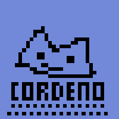

# Cordeno
[](https://doc.deno.land/https/deno.land/x/cordeno@v0.3.0/mod.ts)
[](https://github.com/cordeno/cordeno)
[](https://discord.gg/WT2g6Mn)
[](https://github.com/cordeno/cordeno/commits/)  
An simplistic, event loop driven [Discord API](https://discord.com/developers/docs/reference) library for building powerful bots.  
Powered by the [Deno runtime](https://deno.land/).  
Inspired by [Dinocord](https://github.com/sunsetkookaburra/dinocord).

# Development progress
Cordeno is still in its **early stages of development**, and is not production ready. Many cores features of the Discord API is still missing, and has yet to be implemented.
Breaking changes may occur at any time without prior warning.  
Current master branch version: `0.3.0`  
Find `dev` branch [here!](https://github.com/cordeno/cordeno/tree/dev)  
All current events can be found in the example below, but not every method is listed as of this moment. Take a look at the [documentation](https://doc.deno.land/https/deno.land/x/cordeno@v0.3.0/mod.ts)

# Example:
index.ts
```ts
import {
  Client,
  Message,
  Ready,
  Ratelimit,
  Heartbeat,
  Resumed,
  InvalidSession,
} from "https://deno.land/x/cordeno@v0.3.0/mod.ts";

const client = new Client({
  token: "YOUR TOKEN HERE",
});

console.log(`Running cordeno v${client.version}`);

for await (const ctx of client) {
  switch (ctx.event) {
    case "READY": {
      const ready: Ready = ctx;

      console.log("Cordeno is now ready!");
      console.log("Discord websocket API version is " + ready.gatewayVersion);

      // Sets client presence
      client.user.setPresence({
        status: "online",
        game: {
          name: "Taking over the world!",
          type: "playing",
        },
      });
      break;
    }
    case "RESUMED": {
      const resumed: Resumed = ctx;
      console.log(`Resumed at: ${resumed.resumeTime}`);
      break;
    }
    case "INVALID_SESSION": {
      const session: InvalidSession = ctx;
      console.log(
        `An invalid session occured. Can resume from previous state?: ${session.canResume}`,
      );
    }
    case "RATELIMIT": {
      const ratelimit: Ratelimit = ctx;
      console.log(`A rate limit was hit for the route: ${ratelimit.route}`);
      // deno-fmt-ignore
      console.log(`The ratelimit will reset in ${Math.round(ratelimit.resetIn / 1000 * 10) / 10}s`);
      break;
    }

    case "HEARTBEAT": {
      const heartbeat: Heartbeat = ctx;
      // deno-fmt-ignore
      console.log(
        "Heartbeat recieved: \n" +
        `=>total: ${heartbeat.total}\n=>rate: ${Math.round(heartbeat.rate / 1000 * 10) / 10}s`
        );
      break;
    }
    case "MESSAGE_CREATE": {
      const msg: Message = ctx;
      if (msg.author.id !== client.user.id) {
        if (msg.content === "!ping") {
          await msg.reply(`Pong!`);
          await msg.reply(`Message author: ${msg.author.username}`);
          await msg.reply(`Created at: ${msg.createdAt}`);
          await msg.reply(`Client name: ${client.user.name}`);
          continue;
        }
        if (msg.content === "!cordeno") {
          await msg.reply(`Cordeno version: v${client.version}`);
        }
      }
      break;
    }
  }
}
```
After creating your file and pasting the above code, add your token and run
```shell
deno run --allow-net --reload index.ts
```
The `--reload` tag reinstalls all the dependencies in your project.
You don't have to include `--reload` every run, but I recommend including it as an argument at least once a day to keep cordeno up to date.

# Contributing
[](https://github.com/cordeno/cordeno/graphs/contributors)  
Want to contribute? Follow the [Contributing Guide](https://github.com/cordeno/cordeno/blob/master/CONTRIBUTING.md)
